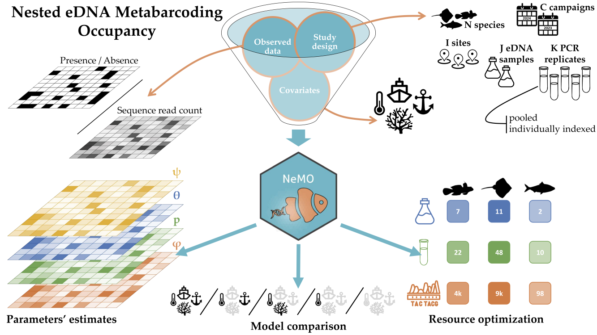

[](https://doi.org/10.1101/2025.05.23.655794)

# NeMO: Nested eDNA Metabarcoding Occupancy 

**NeMO** provides a flexible Bayesian framework for modeling multi-species site occupancy from environmental DNA (eDNA) metabarcoding data. It is designed to support diverse experimental designs and inference goals in molecular ecology, allowing users to estimate the probability of occupancy and species' detectability, even in the face of imperfect detection.

------------------------------------------------------------------------

## Installation

### ⚠️ Before installing **NeMO**, ensure that you have [**JAGS**](https://mcmc-jags.sourceforge.io/) installed on your system.

Install the latest development version from GitHub using the **remotes** package (we recommend installing the vignette as well for a tutoral):

``` r
# Ensure 'remotes' is installed
if (!requireNamespace("remotes", quietly = TRUE)) install.packages("remotes")

# (Optional, but recommended) Install packages required to build the vignette
pkgs <- c("ggridges", "gridExtra", "knitr", "RColorBrewer", "rmarkdown", "tidyverse")
to_install <- pkgs[!sapply(pkgs, requireNamespace, quietly = TRUE)]
if (length(to_install)) install.packages(to_install)

# Install NeMO from GitHub
remotes::install_github("bastien-mace/NeMO", build_vignettes = TRUE)
```

To load the package after installation:

``` r
library(NeMO)
```

To view the vignette:

``` r
vignette('NeMO')
```

------------------------------------------------------------------------

## What does NeMO do?

**NeMO** estimates species occupancy across multiple sites using **environmental DNA (eDNA) metabarcoding** data, incorporating a variety of experimental designs. It allows for the analysis of both **presence/absence data** and **sequence read counts** as indicators of species presence. The package is designed to be flexible and can handle PCR replicates that are either pooled or individually indexed.



For a step-by-step guide on how to use the package, check out the [**vignette**](https://bastien-mace.github.io/NeMO/NeMO.html). The vignette provides detailed instructions on model setup, data handling, and interpretation of results. For more details, you can refer to this [**preprint**](https://doi.org/10.1101/2025.05.23.655794), or to the [**reference manual**](https://github.com/bastien-mace/NeMO/blob/main/docs/NeMO_1.0.0.pdf).

------------------------------------------------------------------------

## Main Inputs

**NeMO** takes three main inputs to generate occupancy models:

1.  **Sequence Read Count or Presence/Absence Data**:\
    The model can accommodate either **presence/absence data** or **sequence read count data**. Sequence count data is typically more informative, allowing for continuous modeling of species detection intensity, while presence/absence data simplifies the analysis to binary outcomes (detected or not detected).

2.  **Study Design** (PCR replication stage):

    -   **Pooled PCR replicates**: When PCR replicates are pooled together, the data reflects an aggregate count of all species detected across all replicates for each eDNA sample.
    -   **Individually Indexed PCR replicates**: Each PCR replicate is treated separately, allowing for more detailed analysis of replicate-specific detection probabilities.

3.  **Optional Environmental or Methodological Covariates**:\
    The model allows for the inclusion of **covariates** at different levels. Covariates help account for the effects of environmental or methodological factors on species occupancy and detectability, improving model fit and interpretability.

------------------------------------------------------------------------

## How It Works

The **NeMO** package runs a **Bayesian occupancy model** that adapts to the input data and study design.

1.  **Occupancy Model**:\
    Species occupancy is modeled as a binary process at each site (occupied or unoccupied). The model accounts for imperfect detection, meaning that it estimates the probability that a species is truly present at a site, even if it was not detected.

2.  **Detection Model**:\
    Species detection is modeled based on **detection probabilities** that may vary with covariates, replication structure, and the sampling effort.

3.  **Bayesian Framework**:\
    **NeMO** uses a **Bayesian framework** for parameter estimation, with **Markov Chain Monte Carlo (MCMC)** methods implemented via the [**R2jags**](https://github.com/suyusung/R2jags) package. This allows for the estimation of model parameters and uncertainty intervals in a probabilistic manner, providing more robust and interpretable results.

------------------------------------------------------------------------

## Main Outputs

Once the model is run, **NeMO** provides the following outputs:

1.  **Parameter Estimates**:
    -   **Occupancy probabilities**: These estimates represent the probability that a species is present at a site, given the observed data and the model's assumptions.
    -   **Detection probabilities**: These estimates describe the likelihood of detecting each species at a given eDNA sample, PCR replicate, or in sequencing output. The model accounts for variation across different replicates and sampling efforts.
    -   **Covariate effects**: The influence of environmental/methodological covariates on species occupancy and detectability is estimated, allowing for deeper ecological insights.
2.  **Model Comparison using WAIC**:
    -   **Watanabe-Akaike Information Criterion (WAIC)** is used to compare different models fitted to the data. WAIC accounts for model complexity and goodness of fit, allowing users to select the most appropriate model for their data.
    -   This feature enables users to perform model comparison, test different hypotheses, and identify the best model based on the data.
3.  **Resource Optimization**:
    -   **NeMO** can estimate the minimum sampling effort required to confidently infer species presence, which is particularly useful in planning future sampling efforts. This can help in determining the number of eDNA samples, PCR replicates, and the sequencing depth that are necessary to achieve reliable results.
    -   This feature supports **resource optimization** for ecological surveys by identifying cost-effective strategies to detect species and estimate occupancy.

------------------------------------------------------------------------

## Applications

**NeMO** can be applied to a variety of ecological questions, such as:

-   **Monitoring biodiversity**: Track the presence/absence of multiple species across a set of sites (*e.g.*, freshwater, marine, or terrestrial ecosystems).
-   **Ecological inference**: Investigate the relationship between species occupancy or detectability and environmental/methodological covariates.
-   **eDNA sampling design**: Use occupancy models to assess the minimum sampling efforts needed to confidently detect species.

------------------------------------------------------------------------

## Citation

If you use **NeMO** in your work, please cite the following preprint:

Macé, B., Manel, S., Valentini, A., Rocle, M., Roset, N., & Delrieu-Trottin, E.
(2025). “NeMO: a flexible R package for nested multi-species occupancy modelling
and eDNA study optimisation.” _bioRxiv_. <https://doi.org/10.1101/2025.05.23.655794>.

You can also retrieve the citation from R:

``` r
citation('NeMO')
```

## Contact & Support

For questions, feature requests, or bug reports, please open an [issue](https://github.com/bastien-mace/NeMO/issues).

## Credits

**NeMO** was created and is maintained by [Bastien Macé](https://github.com/bastien-mace).
